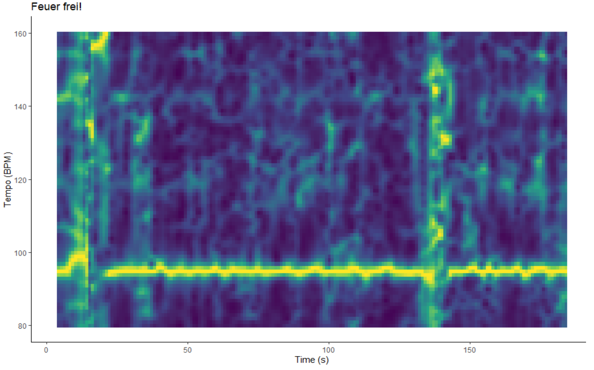

```{r setup, include=FALSE}
library(tidyverse)
library(rvest)
library(spotifyr)
library(fmsb)
library(ggradar)
library(ggplot2)
library(tidyverse)
library(statebins)
library(Rmisc)
library(ggiraph)
library(ggplotlyExtra)
library(RColorBrewer)
library(plotly)
library(scales)
library(lubridate)
library(compmus)
library(factoextra)
library(viridisLite)
library(ggiraphExtra)
library(gridExtra)
library(flexdashboard)
library(DiagrammeR)
library(data.table)
library(dplyr)
library(formattable)
library(tidyr)
library(shiny)
library(shinyWidgets)

all_albums_r <- get_artist_audio_features("rammstein")

studio_albums_r <- all_albums_r %>% 
  filter(album_name != "XXI - Klavier") %>% 
  filter(album_name != "RARITÄTEN (1994 - 2012)") %>% 
  filter(album_name != "Live aus Berlin")

audio_features_r <- studio_albums_r %>% select(track_name, danceability, energy, key, loudness, mode, speechiness, acousticness, instrumentalness, liveness, valence, tempo, album_name)
audio_features_r <- audio_features_r[!duplicated(audio_features_r[c("track_name")]),]
```

### `r emo::ji("fire")` `r emo::ji("rock-on")` Why **Rammstein**? Get to know RQs and corpus `r emo::ji("rock-on")` `r emo::ji("fire")` {data-commentary-width=800}

<div style="max-width:1920px; margin: 0 auto;">

**Rammstein** is a German [Neue Deutsche Härte](https://en.wikipedia.org/wiki/Neue_Deutsche_H%C3%A4rte) band known for heavy riffs, thought-provoking, although controversial, lyrics and flame-fuelled live performances. \
\
Almost unanimously, critics and fans alike agree on the worst **Rammstein** album, which is said to be [*Rosenrot* (2005)](https://open.spotify.com/album/3PrS5X3QNdDUlBIE4bz6J2). Listeners note that the album is “[…] a disjointed effort glued together with some iron-clad bangers” ([Chillingworth, 2019](https://www.loudersound.com/features/every-rammstein-album-ranked-from-worst-to-best)) and “[…] feels like a thrown-together collection of B-sides (because, essentially, it was)” ([sean_themighty, 2019](https://www.reddit.com/r/Rammstein/comments/ap83rs/anybody_agree/)). \
\
Interestingly, album rankings oftentimes also agree on the best album – [*Mutter* (2001)](https://open.spotify.com/album/2tHCY2fDMi0NqeGZcAxNSc), describing it as “[…] just....legendary” ([JonWood007
, 2020](https://www.reddit.com/r/Rammstein/comments/gbbs9i/all_rammstein_albums_ranked_from_worst_to_best/)). Furthermore, the album is ranked 324 in *Rock Hard* magazine's book of *The 500 Greatest Rock & Metal Albums of All Time* ([Rock Hard, 2005](https://en.wikipedia.org/wiki/Mutter_(album)#cite_note-11)). Another strong contender for the title of the most loved **Rammstein** album, sometimes tied with *Mutter*, is [*Sehnsucht* (1997)](https://open.spotify.com/album/2w6Vy8qZLU4niyQAHyu0Ag). The album contains well-known masterpieces, such as *Du hast* and *Engel*. \
\
Additionally, **Rammstein** has quite a recognizable sound that is usually attributed to distinctive guitars along with Till Lindemann’s baritone and exaggerated trills (so-called rolled r’s). \
\
Thus, in this portfolio, I will investigate whether **Spotify's Audio Features** and **Popularity Scores** can provide insights on the following questions: \
**1.** Why *Mutter*/*Sehnsucht* are so well-received, whereas *Rosenrot* is subject to criticism? \
**2.** **Rammstein** signature sound: what audio features are constant throughout the discography? \
**3.** Typical and atypical **Rammstein**: what audio analyses can say about **Rammstein's**  songs? \
\
**Corpus** \
The corpus consists of released studio albums by **Rammstein** (7 albums, 82 songs), all of which are available on Spotify: \
- [*Herzeleid* (1995)](https://open.spotify.com/album/2AXNbmgbX2i21Niol6eYul?si=777b4385f2804971) \
- [*Sehnsucht* (1997)](https://open.spotify.com/album/2w6Vy8qZLU4niyQAHyu0Ag) \
- [*Mutter* (2001)](https://open.spotify.com/album/2tHCY2fDMi0NqeGZcAxNSc) \
- [*Reise, Reise* (2004)](https://open.spotify.com/track/6bvTzuFABmFnAAmVZ3nlMh?si=6c0a34167652445a) \
- [*Rosenrot* (2005)](https://open.spotify.com/album/3PrS5X3QNdDUlBIE4bz6J2) \
- [*Liebe ist für alle da* (2009)](https://open.spotify.com/album/29J0MchD0OWNeiMNbPDwfa?si=4005f993c4f74d90) \
- [*Untitled* (or RAMMSTEIN) (2019)](https://open.spotify.com/album/1LoyJQVHPLHE3fCCS8Juek?si=FnvCowknROKrf1BzXMerBQ) \
\
**Click through the tabs to find out more!**

***


### No clue how **Rammstein** sounds? **Take a listen!** {data-commentary-width=600}

For those who are unfamiliar with the band, I have compiled a short (10 song) playlist with my favourite songs. \
\
**Listen to "RAMMSTEIN: Beyond Du Hast" playlist here** →

***
ADD AT THE END
<iframe src="https://open.spotify.com/embed/playlist/65oczv23Ru6JUSSgLdCnwe" width="300" height="380" frameborder="0" allowtransparency="true" allow="encrypted-media"></iframe>

### Audio Feature overview per album 1: **keys** vary, **mode** is predominantly major {data-commentary-width=500}

```{r out.width = "700px"}
knitr::include_graphics("key histograms.png")
knitr::include_graphics("mode.png")
```

***

To potentially pinpoint the differences that might have contributed to *Mutter*/*Sehnsucht* love and *Rosenrot* hate, it is useful to take a close-up look at Spotify's Audio Features. Furthermore, Audio Features were plotted to see which elements change or stay constant throughout the discography. \
\
The first histogram highlights the **key distribution per album**. Every Rammstein album has notable variation in keys, averaging at 7 keys per album. *Mutter* seems to be an outlier, with only 4 keys implemented, mainly D, E♭, E and A. Overall, **no clear key preference** can be seen throughout the discography. \
\
Second plot is a stacked bar chart that **illustrates minor/major modes in the corpus**. As can be seen, **major mode is preferred throughout all albums**. This might be a shocker for some, as Rammstein’s music does not sound necessarily *positive*, which only further demonstrates that *major ≠ happy* and *minor ≠ sad*.


### Audio Feature Overview per album 2: distinctive **danceability**, **energy**, **valence**, **loudness** and **tempo** {data-commentary-width=500}

```{r out.width = "800px"}
knitr::include_graphics("geom_density album summary.png")
```

***

On the left, **density plots of Spotify Audio Features for Rammstein’s studio albums** are presented. Density plots show smoothed distribution of values and the peaks correspond to locations where there is the highest concentration of said values.\
\
**Danceability** seems to vary per album. It is clear that ***Sehnsucht*** (and *Herzeleid*) have **the highest overall danceability**. Conversely, the majority of songs from ***Rosenrot*** are located **lower on the danceability scale**. \
Interestingly, danceability is one of the most mysterious Spotify’s Audio Features, as the listener’s perception of danceability for a song sometimes conflicts with the value awarded by Spotify. For instance, [Du Riechst So Gut](https://open.spotify.com/track/73se54LukI1xEPE8XKsrWf) has a danceability score of 0.67/1, whereas [I'm Looking Forward to Joining You, Finally (Nine Inch Nails)](https://open.spotify.com/track/7hZ59R6Kg7oV5WEmpPFC64?si=b52b2a9a37b24296) was awarded with a striking score of 0.795/1.\
\
**Energy** distribution per album shows that overall, Rammstein’s discography boasts high energy. ***Sehnsucht’s* energy is concentrated at around 0.95**, while ***Rosenrot’s* energy peak is seen at 0.7**. \
\
Next, **valence** plot marks ***Rosenrot* as a clear outlier**. Low valence corresponds to more sad, angry music.\
\
Another interesting visualization is **loudness**. Both ***Rosenrot* and *Sehnsucht* exhibit a strong peak at -5**. Although ***Mutter’s*** highest density shares the same value, the **peak is weak**. \
\
Finally, regarding **tempo**, ***Rosenrot* has more songs in 160 BPM** tempo range than other albums. \
\
**Speechiness**, **liveness**, **acousticness** and **instrumentalness** do not seem to provide any interesting patterns regarding the three albums in question and also overall. \
\
**Audio Feature Overview Conclusion:** *Mutter*, *Sehnsucht*, *Rosenrot* are going to be analyzed in-depth based on **danceability**, **energy**, **valence**, **loudness** and **tempo**, as these features differ per album.


### **(A)Typical Rammstein**: perception and computation {data-commentary-width=450}
```{r}
heatmap_data <- read_csv(file = "heatmap_test.csv")
heatmap_data[, 3] <- round(heatmap_data[, 3], digits = 3)

heatmap_table <- ggplot(heatmap_data, aes(x = Feature, 
                                          y = Song, 
                                          fill = Value)) +
  geom_tile() + 
  theme_minimal() + 
  scale_x_discrete(position = "top") + 
  scale_y_discrete(limits = c("Roter Sand - Orchester Version", "Ein Lied", "Ausländer", "Te Quiero Puta!", "Hallomann", "Feuer Frei!", "Ich will", "Du Hast")) +
  scale_fill_gradient(low = "#f0c7c7",
                      high = "#db0707",
                      space = "Lab",
                      na.value = "grey50",
                      guide = "colourbar",
                      aesthetics = "fill") + 
  theme(axis.ticks.x = element_blank(),
        axis.ticks.y  =  element_blank(),
        axis.text = element_text(size = 7),
        legend.text = element_text(size = 7),
        legend.title = element_text(size = 9),
        panel.grid = element_blank()) +
  ggtitle("Spotify Audio Features for typical and atypical Rammstein songs")

show <- ggplotly(heatmap_table, height = 500, width = 800)
show 

table_typatyp <- read_csv(file = "other_features.csv")

table_ta <- formattable(table_typatyp, 
            align =c("l","c","c", "c", "r"),
            list('Loudness' = color_tile("#f0c7c7", "#db0707"), 
                 'Tempo' = color_tile("#f0c7c7", "#db0707")))
table_ta
```

***

For detailed, low-level audio analysis, typical and atypical songs have to be established. \
\
What songs would make you exclaim “yes, of course this is Rammstein!”? Personally, I chose **Du hast** and **Ich will**. Of course, this approach is *highly subjective* and influenced by a plethora of external reasons, such as *track popularity*, *familiarity with the artist*, *individual biases* and *tastes*. To expand the notion of “typical” to include not only my personal judgements, but also those of a potentially impartial algorithm, **standardizes z-scores** based on all audio features were computed. The songs that scored nearest to 0, mainly **Feuer Frei!** and **Hallomann** were chosen as representatives. \
\
The same approach was taken when selecting atypical songs. In my opinion, **Te Quiero Puta!** may be the most *un-Rammstein* song they have ever released. In the context of all their other recordings, this *metal-meets-mariachi* song sounds novel. Another unique track is **Ausländer**. It sounds so *catchy and pop-y*, that it might have been a successful (rock)club song. Unsurprisingly, z-scores (z > 2) indicated that **Ein Lied** and **Roter Sand – Orchester Version** differ from the rest of the corpus, as these are Rammstein's ballads. \
\
**Summary:** \
- **typical songs** - Feuer Frei!, Hallomann, Ich will, Du Hast; \
- **atypical songs** – Ein Lied, Roter Sand – Orchester Version, Te Quiero Puta!, Ausländer. \
\
The Spotify Audio Features per song are presented in an interactive heat table on the left. Additionally, I compiled a playlist of typical/atypical songs! ↓
ADD PLAYLIST!!!!!!!!!!!!!!!!!!!!


### **Valence** and **Energy** in context: **Rammstein** is *angry*, but also *happy* and not *calm* at all {data-commentary-width=700px}
```{r}
what_is <- ggplot(audio_features_r, aes(x = energy, y = valence, label = track_name)) + 
  geom_point(aes(color = album_name)) +
  theme_minimal() +
   scale_x_continuous(         
    limits = c(0, 1),
    breaks = c(0, 0.5, 1),   
    minor_breaks = NULL       
  ) +
  scale_y_continuous(
    limits = c(0, 1),
    breaks = c(0, 0.5, 1),
    minor_breaks = NULL
  ) +
  geom_vline(xintercept = 0.5, linetype="dotted", color = "black", alpha = 0.7) + 
  geom_hline(yintercept = 0.5, linetype="dotted", color = "black", alpha = 0.7) + 
  annotate("text", 0.05, 0.05, label = "Sad", color = "black", fontface="bold") +
  annotate("text", 0.05, 0.95, label = "Calm", color = "black", fontface="bold") +
  annotate("text", 0.95, 0.05, label = "Angry", color = "black", fontface="bold") +
  annotate("text", 0.95, 0.95, label = "Happy", color = "black", fontface="bold") +
  labs(x = "Energy", y = "Valence", title = "Rammstein's emotions", colour = "Album", label = "track_name")
ggplotly(what_is, tooltip = "track_name", height = 500, width = 950)
```

***
Spotify's Audio Features sometimes might seem a bit isolated from the real world. **Valence** is said to be ["a measure describing the musical positiveness conveyed by a track"](https://developer.spotify.com/documentation/web-api/reference/#object-audiofeaturesobject). The higher the valence score, the more positive, happy and cheerful the song sounds. **Energy** is labelled as ["perceptual measure of intensity and activity"](https://developer.spotify.com/documentation/web-api/reference/#object-audiofeaturesobject). Tracks with high energy are typically fast, loud and noisy. \
\
But how **perceptually sound** these measures *really* are?\
\
To tackle this question, I decided to look at the corpus in the context of **[valence-arousal model of emotion (circumplex model)](https://content.apa.org/record/1981-25062-001)**. In this model, emotions are distributed in a 2D circular space. The dimensions are arousal (Spotify's energy) and valence. The combinations of these features result in 4 emotion quadrants - **calm**, **happy**, **sad** or **angry**. Placing Rammstein's songs in this model can provide us with an overview of the emotions that their music evokes. \
\
The results of the classification are quite fascinating. Firstly, Rammstein has **no calm** songs, as the quadrant is absolutely empty. This is not unexpected, as Rammstein has only few ballads and those are in the *calm* category. The songs that are the closest to being *calm* are *[Los](https://open.spotify.com/track/679Tyyun9r41BvpDOTAAOo?autoplay=true)* and *[Laichzeit](https://open.spotify.com/track/7BQWcPnFAlkPVxJQAf20aq?autoplay=true)*. Perceptually, these two tracks might sound more monotone compared to others in *happy*, which places them lower on the energy scale, but they are still loud and fast. It is also a bizarre and grim experience seeing a song about incest and bestiality (Laichzeit) in the *happy* category...\
\
Secondly, the **happiest songs are [Bestrafe mich](https://open.spotify.com/track/5QueZSIpWUbH4nLZlkjjkP?si=108dc6646b134604) and [Eifersucht](https://open.spotify.com/track/2R5Zsb2TtsjHAEJFUZvf7v?si=00d5442604b84d03)**. Please take a listen and judge yourself whether these songs sound happy! I would guess that they do not. To me, [Ausländer](https://open.spotify.com/track/7j43FohbLVulScL7S9sQZk?si=3fbfb78e83f04eb8) is the happiest track out of the whole discography, but it is in the *angry* quadrant. These misalignments might indicate that Spotify's **features do not directly correspond to arousal and valence of the circumplex model**. \
\
The **angriest song is [Rammlied](https://open.spotify.com/track/2BQFnSQymvASqEMIrwe7tp?si=16cb452cbf3c4fa9)**, which I agree with. This powerful album opening song has an apocalyptic vibe to it, with a pronounced bass guitar and devilish Till's vocals juxtaposed with church choir in the background. This is a grandstanding song that just sounds *powerful and furious*. \
\
Unsurprisingly, **[Ein Lied](https://open.spotify.com/track/4L4oCtdmqjxS8AjkzjLGDQ) is the most unhappy song**. Ein Lied is one of their slowest songs, with acoustic guitars, ethereal synthesizers and theremin-like keyboards being the focus of the song's instrumental. The percussion is completely absent from this song. The vocal line is soft, partly spoken, partly sung using low breathy tones, which is atypical of Rammstein. \
\
Overall, **the majority of songs are in the *angry* category and none in *calm***, which, in my opinion, aligns with the public's perception of Rammstein and metal music in general. No specific trends per album can be seen. 

### **Chromagrams**: energy in *E* for *typical* and *atypical* {data-commentary-width=400}

```{r}
knitr::include_graphics("chroma features.png")
```

***

The **chromagram** shows **how much energy there is in a certain pitch class per moment of time**. Let's see how different or similar typical and atypical songs' chromagrams are. \
\
Firstly, **all 3 songs' predominant energy** is in class **E**. It is marked by yellow horizontal bands that can be seen throughout the songs. In **Du hast**, there is a *slight shift towards B* in the second part of the song, but E is still active. \
\
Secondly, **Roter Sand's song structure** can be easily worked out just by looking at the chromagram. There are **well-defined blocks**, marking the verses and the chorus, giving the song **ABABB** structure. For **Du hast** and **Ein Lied**, the structure is less clear, as the chromagrams show minimal variation compared to *Roter Sand*. Thirdly, in general, **Du hast's** chromagram has less magnitude.

### **Self-similarity matrices (SSM)**: *repetitiveness and clear structure = atypicalness*?  {data-commentary-width=400}

```{r}
knitr::include_graphics("self similarity auslander du hast.png")
#knitr::include_graphics("self similarity roter sand halloman.png")
```

***
On the left, you can see **self-similarity matrices**, where both x and y axes show seconds. **SSMs illustrate pitch- and timbre-based similarity within a chosen track**. The line from the bottom left corner to top right corner is a constant, as we are comparing the song to itself. Are there **systematic differences**, seen SSMs, that **differentiate typical and atypical tracks** of the corpus? \
\
In chroma SSM for **Ausländer** (*atypical*), we can see **clear repetitiveness and structure**, as there are visible *checkerboard patterns*, indicating song's homogeneity. The structure of a song, that is **ACBACB**, is represented on the plot. Bright yellow lines, seen often in both chroma and timbre SSMs, mark moments of novelty in *Ausländer*. \
\
Plot for **Du hast** (*typical*) tells us a completely different story. Overall, the SSMs are dark, indicating that there are **few novel** moments throughout the song, mainly 1 - at around 145 s, when there is an almost a silent moment in the song. Hardly anything can be said about the song structure, as there are no patterns seen. Overall **timbre is constant**; the song is more or less similar timbre-wise. \
\
SSMs have shown that **a typical and an atypical song differ in repetition and novelty patterns**. 

### **Chordograms**: *Du hast* and *Te Quiero Puta!* are matching

```{r}
knitr::include_graphics("chordograms.png")
```

***
**Chordograms** show what chords are active at a particular point of time. \
\
Though **Du hast** is labeled as **typical** by me, and **Te Quiero Puta!** **atypical**, they have a very **similar chord profile**. In both songs, **G#:min, D:maj and F:7 are the most active**. Also, around 150 s, both of the chordograms exhibit a yellow line, indicating that the bridge has started. \
\
**Te Quiero Puta!** is unusual for *Rammstein* mainly because it is their only song fully written in *Spanish*. In addition, the **brass section** (trumpets) is striking and has never been as pronounced as in *Te Quiero Puta!*; the song has a strong *Hispanic flair* to it. \
\
Overall, the **chord similarity** is understandable, as both songs have the **Rammstein sound** to them, that is heavy, distorted guitars.

### **Rammstein's** *preferred tempo*: does it align with Moelants'? {data-commentary-width=330}
```{r}
knitr::include_graphics("tempo density.png")
```

***
[Moelants (2002)](https://citeseerx.ist.psu.edu/viewdoc/download?doi=10.1.1.465.8019&rep=rep1&type=pdf) showed that there is a certain **preferred tempo at around 125 BPM**. This natural tempo corresponds with both repeated motor actions, such as finger tapping, and perceived tempo in musical data. As can be seen from the plot, **Rammstein's** songs mostly fall in **115-140 BPM** frame, with a **visible peak at 120-130 BPM**. \
\
Moelants' findings, current corpus' tempo distribution and [Spotify's own value distribution for tempo](https://developer.spotify.com/assets/audio/tempo.png) align pretty neatly, with **noticeable spikes at 120-130 BPM** marks.\
\
Although metal music can cover a wide scale of tempos, **preferred tempo range is still reflected in Rammstein's discography**, further indicating that it indeed might be more *natural* to compose songs in that tempo range.\

### *Tempograms*: **Ich will** is *faster* than **Feuer frei!**? {data-commentary-width=650}

```{r out.width = "650px"}

knitr::include_graphics("tempograms.png")
```

***
The two cyclic **tempograms** at the left illustrate Spotify's estimated tempo for two typical songs: [*Feuer Frei!*](https://open.spotify.com/track/73JZKk0nb1WOUmh1Eo3Unc?si=d4ce04364a7b416c) and [*Ich will*](https://open.spotify.com/track/3X0K6fII7VIwL1URPrp8Ko?si=0452ce9b758a40a4). Overall, the estimated **tempo** (yellow line) is **strong and stable** throughout the duration of both songs. The excerpts where the **line breaks** correspond to fragraments of the songs where **minimal instrumental accompaniment** is present. \
\
Interestingly, **Feuer Frei! sounds way faster to me than Ich will**. I would even say that *Feuer Frei!* is one of the fastest songs in the corpus, whereas Spotify claims that it is actually on the slower side. My personal estimation of tempo for **Feuer Frei!** would stand at around twice Spotify's - **190 BPM**. **Ich will's** BPM makes sense, as it is indeed **~128 BPM**.\
\
Because Spotify's BPM estimation might be based on tatums, which are subdivisions of beats, we get this inaccurate tempo. In short, if there is one particular tempo, Spotify probably captures twice and thrice the BPM. Spotify most probably chose the lower band (*tempo subharmonic*), which we now see on the *Feuer frei!* tempogram - **95 BPM**, whereas the *true* tempo is twice as fast - **190 BPM**. \
\
Here we saw an example of Spotify API's faulty judgement, along with an accurate one. **Spotify's beat tracking technique is not bulletproof!**

### **Rammstein *sound*** - are there any constants in the corpus? {data-commentary-width=500}

```{r}
constants <- read_csv("constant_features.csv")

constants$Album <- factor(constants$Album, levels = c("Herzeleid (1995)", "Sehnsucht (1997)", "Mutter (2001)", "Reise, Reise (2004)", "Rosenrot (2005)", "Liebe ist für alle da (2009)", "Rammstein (2019)"))

constants_plot <- ggplot(data = constants, aes(x = Album, y = Value, group = Feature)) +
  geom_line(aes(colour = Feature)) +
  geom_point(aes(color = Feature), alpha = 0.5, shape = 23, size = 2) + 
  theme(axis.text.x = element_text(angle = 45),
        axis.line = element_line(colour = "black"),
        panel.grid.minor.x = element_blank(),
        panel.grid.major.x = element_blank(),
        panel.background = element_rect(fill = 'white'),
        panel.grid.major.y = element_line(color = "grey")) +
  scale_color_manual(name = "Feature", values = c("orangered2", 
                                                  "salmon4", 
                                                  "darkgrey", 
                                                  "darkblue")) +
  ggtitle("Mean Audio Feature Value per Album")
ggplotly(constants_plot, height = 400, width = 800)
```

*** 
After feature overview in the previous tabs, more or less homogeneous features throughout the discography were plotted. The plot on the left shows mean feature values per album. \
\
As can be seen, the only truly constant feature is **speechiness**. Speechiness detects the presence of spoken words, so it is natural that Rammstein's albums **constantly score low**, as they contain non-speech-like tracks. \
\
**Acousticness** was below 0.04 for the first 4 albums, but rose starting *Rosenrot*. That is not surprising - *Rosenrot* has their first acoustic ballad, *Ein Lied*. *LIFAD* includes *Roter Sand*, *Roter Sand (Orchester Version)* and [*Liese*](https://open.spotify.com/track/6mdhbYs5sY1fXFk86bsnyD?si=0b0137fca8954bda), *Rammstein* has [*Diamant*](https://open.spotify.com/track/1UZs9dauJnxrqYxMIzxnwC?si=1772b45d8f334bbe). \
\
**Instrumentalness** is all over the place, as albums do vary in vocal content per song. **Liveness** detects the presence of an audience in the tracks. The differences can be attributed to background cheers and other noisy effects used, such as marching sounds in [*Links 2 3 4*](https://open.spotify.com/track/52XYwQKlXp7scE7KrBBCID?si=4301bb2dcb7047a0), and Till's crowd-like counting in [*Sonne*](https://open.spotify.com/track/3gVhsZtseYtY1fMuyYq06F?autoplay=true). \
\
In conclusion, **only speechiness can be considered a constant feature throughout Rammstein's discography**, but it is **not likely** to be a feature that can characterize the ***Rammstein sound***.

### **Popularity**: *Sehnsucht* and *Mutter* are still relevant, but is *Rosenrot*? {data-commentary-width=500}
```{r}
pop_overall <- read_csv(file = "pop_sel_alb_tot.csv")

pop_overall$album.year <- factor(pop_overall$album.year, levels = c("Herzeleid (1995)", "Sehnsucht (1997)", "Mutter (2001)", "REISE, REISE (2004)", "ROSENROT (2005)", "LIEBE IST FÜR ALLE DA (2009)", "RAMMSTEIN (2019)"))

pop_alb <- read_csv(file = "pop_only_albums.csv")

pop_boxplot <- ggplot(pop_overall, aes(x = album.year, 
                                       y = track.popularity,
                                       label = track.name,
                                       colour = album.year)) +
  geom_boxplot(show.legend = FALSE,
               alpha = 0.4,
               outlier.shape = NA) +
  geom_jitter(data = pop_overall, 
              width = 0.25, 
              alpha = 0.7,
              show.legend = FALSE) +
  geom_hline(yintercept = 81, linetype = "dashed", color = "red") +
  geom_text(aes("REISE, REISE (2004)", 83, label = "Rammstein Popularity", vjust = -1), colour = "black") +
  labs(title = "Spotify popularity metric: song, album, artist. (+ indicates album's popularity)",
       x = "Albums",
       y = "Popularity") +
  theme(legend.position = "none",
        axis.text.x = element_text(angle = 45),
        axis.line = element_line(colour = "black"),
        panel.grid.minor.x = element_blank(),
        panel.grid.major.x = element_blank(),
        panel.background = element_rect(fill = 'white'),
        panel.grid.major.y = element_line(color = "grey")) +
  scale_color_manual(name = "album.year", values = c("orange", 
                                                     "darkblue", 
                                                     "darkolivegreen2", 
                                                     "orangered2", 
                                                     "royalblue2", 
                                                     "wheat4", 
                                                     "tan")) +
  geom_point(aes(x = "Herzeleid (1995)", y = 67), colour = "black", shape = 3) +
  geom_text(aes("Herzeleid (1995)", 69, label = "67", vjust = -1), size = 3, colour = "black") + 
  geom_point(aes(x = "Sehnsucht (1997)", y = 74), colour = "black", shape = 3) +
  geom_text(aes("Sehnsucht (1997)", 76, label = "74", vjust = -1), size = 3, colour = "black") + 
  geom_point(aes(x = "Mutter (2001)", y = 75), colour = "black", shape = 3) +
  geom_text(aes("Mutter (2001)", 77, label = "75", vjust = -1), size = 3, colour = "black") + 
  geom_point(aes(x = "REISE, REISE (2004)", y = 73), colour = "black", shape = 3) +
  geom_text(aes("REISE, REISE (2004)", 75, label = "73", vjust = -1), size = 3, colour = "black") + 
  geom_point(aes(x = "ROSENROT (2005)", y = 68), colour = "black", shape = 3) +
  geom_text(aes("ROSENROT (2005)", 70, label = "68", vjust = -1), size = 3, colour = "black") + 
  geom_point(aes(x = "LIEBE IST FÜR ALLE DA (2009)", y = 70), colour = "black", shape = 3) +
  geom_text(aes("LIEBE IST FÜR ALLE DA (2009)", 72, label = "70", vjust = -1), size = 3, colour = "black") + 
  geom_point(aes(x = "RAMMSTEIN (2019)", y = 77), colour = "black", shape = 3) + 
  geom_text(aes("RAMMSTEIN (2019)", 79, label = "77", vjust = -1), size = 3, colour = "black")
ggplotly(pop_boxplot, tooltip = c("track.popularity", "track.name"), height = 500, width = 800)
```
***

To take as much as I can from Spotify's available data, I also explored the **popularity metric**. Spotify is a bit secretive about the algorithm behind popularity scores, so it is helpful to illustrate datapoints. \
\
Spotify provides popularity scores on 3 levels: **track**, **album** and **artist**. All 3 levels can be seen on the interactive plot on the left. Feel free to explore and see where your favorite songs land! \
\
[Spotify's documentation page](https://developer.spotify.com/documentation/web-api/reference/#object-audiofeaturesobject) tells us that "the value is between 0 and 100, with 100 being the most popular. The track popularity is calculated by algorithm and is based, in the most part, on the **total number of plays the track has had and how recent those plays are**. **Artist** and **album** popularity is ***derived mathematically* from track popularity**." \
\
In theory, if **Rosenrot** is the **least favoured** album, the popularity score on all levels should be the **lowest** among the discography. Conversely, **Mutter** and **Sehnsucht** should have the highest ratings. So does Spotify's data actually support this hypothesis? \
\
The answer is *yes* and also *no*. On the track level, **Rosenrot does not contain *only* unpopular songs**. On the album level, however, **Rosenrot is the second least popular album** (68), with *Herzeleid* occupying the first place. One can argue that the recency factor came into play here. *Herzeleid (1995)* was the band's debut album, which came out 25 years ago. *Rosenrot (2005)* is *relatively* new. I think it is a bit tricky to compare such old albums to newer ones; still, *Herzeleid's* median is higher (54) than *Rosenrot's* (50). Moreover, album-level popularity differs by only 1 point. \
\
As for **Mutter (2001)** and **Sehnsucht (1997)**, although both of the albums were released a while ago, they are still **very popular on both track and album levels**. On the album level, *Mutter* (75) and *Sehnsucht* (74) share the second and the third place, respectively, overtaken only by **RAMMSTEIN**. *RAMMSTEIN's* popularity might be explained by the fact that it is their most recent album (2019).\
\
If we take a look at the track level, **Mutter's** median is **60**, the same value as **RAMMSTEIN's**. Although **Sehnsucht's** median is lower, it contains some of the most popular songs in the corpus - **Du Hast (72)** and **Engel (68)**. **Sonne (69)**, the highest rated song from **Mutter** is also in the top 5 most popular Rammstein's songs at the moment. \
\
What is going on with **Liebe ist für alle da (2009)**, though? The tracks are low on the popularity scale, but the album's popularity is comparatively high (70). These ratings seem counterintuitive. The explanation might be hidden in some Spotify's algorithm's pecularity, as the raw popularity is probably scaled separetely per level (track, album, artist). \
\
The most attentive readers might have noticed, that atypical songs - **Ein Lied** (45, *Rosenrot, 2005*) and **Roter Sand - Orchester Version** (31, *LIFAD, 2009*) are not only the **least popular songs** from the albums, but also in the whole discography. \
\
All in all, we can see a trend: despite being older albums, **Sehnsucht (1997) and Mutter (2001) are more popular than their newer counterpart Rosenrot (2005)**.

### **Which album is this song from?** Algorithm is *baffled* by Rammstein {data-commentary-width=550}
```{r}
knitr::include_graphics("all features prediction.png")
```

***
**k-Nearest Neighbour (k-NN) classification algorithm** has been applied to the dataset in order to classify the songs into albums using computational methods. If the predictions are accurate, we can infer that albums significantly differ from each other, which would further aid my *Mutter/Sehnsucht* vs *Rosenrot* debate. \
\
Unfortunately, k-NN performs poorly on Rammstein's discography. The **best obtained score is 5/11 songs correctly classified**, that is for *Herzeleid*. Precision and recall scores, summarized below, indicate an abundance of both false negatives and false positives. For instance, for *RAMMSTEIN* album, both precision and recall are 0. \
\
**Low recall** means that songs from a particular album are not categorized into the same album by the algorithm. **Low precision** means that the algorithm also thinks that a lot of songs from other albums belong to an album in question. The only acceptable scores are for *Herzeleid*, although recall is still quite poor. \
\
**Album (Precision, Recall)**: \
- Herzeleid (0.7142857, 0.4545455) \
- LIEBE IST FÜR ALLE DA (0.2500000, 0.1875000) \
- Mutter (0.1428571, 0.1818182) \
- RAMMSTEIN (0.0000000, 0.0000000) \
- Reise, Reise (0.2000000, 0.1818182) \
- ROSENROT (0.2307692, 0.2727273) \
- Sehnsucht (0.2500000; 0.2727273) \
\
Choosing top predictors (loudness, c12, c04) and features used for previous analyses (danceability, energy, valence, loudness and tempo) did not majorly improve things. \
\
**Training a classifier using so many categories (Audio Features, timbre components), whilst having a small corpus (82 songs) will most probably lead to poor performance, as the variability is extremely high. No definite conclusions can be drawn from k-NN results. **


### **Hierarchical k-Means clustering**: *Sehnsucht* & *Mutter* are Neighbours, *Rosenrot* is their Distant Friend {data-commentary-width=650}
```{r out.width = "530px"}
knitr::include_graphics("Distance matrix for albums1.png")
knitr::include_graphics("Hierarchical clustering.png")
```

***
K-NN is a supervised learning algorithm that is useful for classification and regression problems. As was seen from the previous tab, the performance is lacking. \
\
I have decided to use an unsupervised learning algorithm made to tackle clustering problems, that is **hierarchical k-means**. \
\
To begin with, I wanted to know whether it is *sensible* to conduct these analyses at all. I generated a **distance matrix** to see if there are any preliminary clustering trends.
I decided to focus on the features that were determined to be potentially characteristic after analyzing the density plots in previous tabs. The **distance matrix** on the left based on danceability, energy, valence, loudness and tempo shows the Euclidean distance between album pairs. The closer to 0 (black colour), the less distance, thus the more similar are albums. There is a black diagonal line that indicates that albums are identical, that is distance = 0, because we are comparing an album to itself. \
\
The matrix shows that *Rosenrot* seems to be similar to *RAMMSTEIN*, whereas *Sehnsucht* is quite different from every other album. Looks promising! \
\
The **results of the hierarchical k-means can be seen in the second plot**. The algorithm grouped similar objects together. **Objects within each cluster are more similar to each other than to those outside the cluster**. \
\
The amount of clusters (3) was chosen after applying the [elbow method](https://en.wikipedia.org/wiki/Elbow_method_(clustering)). 
In this method, sum of squares at each number of clusters (in my case, from 2 to 5) are calculated and plotted. Afterwards, by determining the "elbow" (a point at which the slope changes from steep to shallow), the user can determine an optimal number of clusters. This method is not as precise as other, more mathematically-rigorous cluster validation methods, but seemed to work for the current (small) dataset. \
\
Indeed, as can be seen from both the distance matrix and hierarchical k-means clustering, **Sehnsucht and Mutter share more similarities with each other than with Rosenrot**, which is grouped with RAMMSTEIN, which **supports the idea that Rosenrot is somehow different from Mutter and Sehnsucht**. \

### **Conclusion**: *Spotify* is *fun* and **Rammstein** is **chaotic**
<div style="max-width:1920px; margin: 0 auto;">

In this portfolio, I have explored Rammstein's discography and tried to unravel the mystery behind album acclaim. In total, 82 songs were used for the analyses, from which 4 typical and 4 atypical songs were chosen. \
\
Here is a **summary of the main findings**: \
- **Mutter and Sehnsucht are in the same cluster, whereas Rosenrot is in a separate one**, based on *danceability, energy, valence, loudness and tempo* \
- **Rosenrot**, albeit newer, **is less popular than Mutter and Sehnsucht** \
- only **speechiness** is *truly constant* throughout the discography \
- there are **similarities** (chromagrams, chordograms) and **differences** (SSM) between **typical and atypical songs** \
\
Based on these findings, I can conclude that **lower danceability, lower energy, lower valence, loudness and tempo variations** *might* have contributed to **Rosenrot** hate. I am emphasizing *might*, because I do believe that *other factors* than musical features have a more substantial weight in such popularity distribution. **Rosenrot (2004)** is basically a *b-side album*, released 1 year after a succesful **Reise, Reise (2004)**. It was originally intended to be titled *Reise, Reise, Vol. II*. The album lacks distinctiveness and personality, as it really sounds like a compilation of non-single songs. **Sehnsucht** and **Mutter**, on the other hand, contain strong singles (i.e. Engel, Du hast, Sonne, etc.) along with charting b-sides (i.e. [Bück dich](https://open.spotify.com/track/0SCkN2QprWk02svK0HCZ2n?si=242f4bc3b76f4172)). This trend also seen in **popularity scores**. It is important to mention that album success is majorly influenced by marketing, producers, etc. \
\
Also, **Rammstein sound** could not be attributed to a single Spotify Audio Feature. **Rammstein** represent the dance-metal genre, which is a cross between alternative metal and electro-industrial music genres. This genre hodgepodge is characterized by predominantly German lyrics, overpronounciation of certain letters (/r/, in this case) and heavily distorted, low guitars. These cues help listeners to identify **Rammstein** as **Rammstein**, the pioneers of Tanzmetall. An **important extra-musical constant**, especially considering that the band has been active for 25+ years, are the **group members**. The group's composition hasn't changed once, which contributes to the continuous **Rammstein sound**. Comparing **Rammstein** to other Neue Deutsche Härte/metal bands could provide more information on why their sound is so recognizable. Comparing bands within a genre would also expand this research's *external validity*. \
\
Analysis of **typical and atypical songs** has shown that although the songs differ, they are obviously a **part of one artist's coherent discography**. The tempo estimation and popularity exploration indicate that it is **not a good idea to take Spotify's data at face value**, as the **algorithms behind the API might be, to some extend, unsound**. As mentioned in the Audio Feature Overview, *danceability* is one of the mysterious features that might raise an issue of *construct validity*. Nevertheless, Spotify API provides a lot of valuable features that can be used for MIR and musicological research. \
\
I would like to mention one drawback, that is the fact that **lyrics** were not taken into account for this research. Lyrical content is of crucial importance to **Rammstein**, as Till *poetically* sings about taboo topics, such as *cannibalism* ([Mein Teil](https://open.spotify.com/track/4Hp6GJYHQxhb3OyFicO79j)), *stalking* ([Du Riechst So Gut](https://open.spotify.com/track/73se54LukI1xEPE8XKsrWf?si=e6298d1a28e24a74)) and *pyromania* ([Benzin](https://open.spotify.com/track/1XanLfYUUBB6bLbnSh1KyU?si=786767a37bd04984)). Most of the lyrics are inspired or based on real-life events. Conducting **sentiment analysis** on the lyrics and **analyzing Spotify API's provided features** would be useful for future research. Such a combination would control for a possible confounding variable, that is lyrical content, that might have altered the *internal validity* of the current research. \
\
I hope that this informal exploratory research can **motivate** at least one person to look into Spotify and investigate their favourite musician's discography. I believe that the analysis techniques and findings provide insights for any curious reader on **how Spotify Audio Features can be used to analyze audio on different levels**. The majority know **Spotify** merely as a *streaming service*, but it is truly amazing at how much information is **freely available** and can be extracted from Spotify API! 

***


