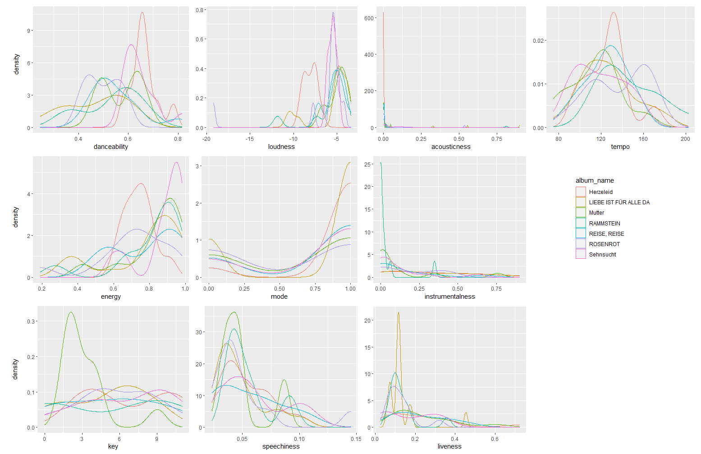
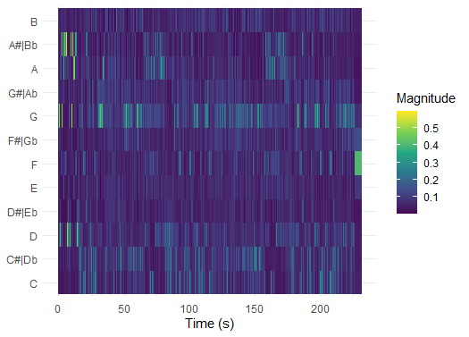

### Rammstein: Exploring Album Acclaim through Spotify Audio Features
**Rammstein** is a German Neue Deutsche Härte band known for heavy riffs, thought provoking, although controversial, lyrics and flame-fuelled live performances. \
\
Almost unanimously, critics and fans alike agree on the worst **Rammstein** album, which is said to be *Rosenrot* (2005). Listeners note that the album is “[…] a disjointed effort glued together with some iron-clad bangers” ([Chillingworth, 2019](https://www.loudersound.com/features/every-rammstein-album-ranked-from-worst-to-best)) and “[…] feels like a thrown-together collection of B-sides (because, essentially, it was)” ([sean_themighty, 2019](https://www.reddit.com/r/Rammstein/comments/ap83rs/anybody_agree/)). \
\
Interestingly, album rankings oftentimes also agree on the best album – *Mutter* (2001), describing it as “[…] just....legendary” ([JonWood007
, 2020](https://www.reddit.com/r/Rammstein/comments/gbbs9i/all_rammstein_albums_ranked_from_worst_to_best/)). Furthermore, the album is ranked 324 in *Rock Hard* magazine's book of *The 500 Greatest Rock & Metal Albums of All Time* ([Rock Hard, 2005](https://en.wikipedia.org/wiki/Mutter_(album)#cite_note-11)). Another strong contender for the title of the most loved **Rammstein** album, sometimes tied with *Mutter*, is *Sehnsucht* (1997). The album contains well-known masterpieces, such as *Du hast* and *Engel*. \
\
Taking into account these observations, I thought of exploring **Rammstein**’s discography to possibly discover underlying patterns behind such rankings. I myself represent team *Mutter*, so it would be interesting to see if Spotify audio features can provide insights into why the album sounds so good. \
\
Additionally, **Rammstein** has quite a recognizable sound that is usually attributed to distinctive guitars along with Till Lindemann’s baritone and exaggerated trills (so-called rolled r’s). \
\
The preliminary **research questions** that I would like to address are <sub>(I am not completely sure about any of these predictions)</sub>:
1. *Mutter* vs *Sehnsucht* - according to Spotify audio features, what are the similarities and differences between these liked albums? Is there a prominent feature that can be seen as one of the causes of such fan and critic adoration? \
Predictions: similarities - low acousticness, minor mode, low instrumentalness; differences - energy, loudness.
2. *Mutter* (maybe with *Sehnsucht*, depends on the outcome of RQ 1) vs *Rosenrot* - similarities and differences. Is there a key feature that can be tied to *Rosenrot*'s unpopularity? \
Prediction: significant similarities - high valence, high energy; significant differences - key, BMP.
3. ***Rammstein** sound* - are there any Spotify audio features that are constant throughout the whole discography and can be used to describe the signature sound? \
Prediction: low acousticness, high energy, low instrumentalness, low liveness, high loudness, mode minor, (medium danceability).
<!-- -->
The proposed corpus consists of released studio albums by **Rammstein** (7 albums, 82 songs), all of which are available on Spotify. In my opinion, the corpus is representative of the whole discography, as the majority of songs are included in the studio albums. The exceptions are *Das Modell* (non-album single, 1997), *Du riechst so gut '98* (which is a version of *Du riechst so gut* (*Herzeleid*, 1995) with a shorter intro) and *Mein Land* (exclusive to compilation album *Made in Germany 1995–2011* (2011)). Live albums are not taken into account, as the (fan-)reviewers usually do not rate live albums. Furthermore, there are no songs exclusive to live albums. \
\
As an example of a typical track, I would choose *Du hast* (1997). Setting aside the lyrical component, how did a metal song become so mainstream? It would be interesting to dissect the song in Spotify. \
\
An atypical track, in my opinion, is *Te Quiero Puta!* (2005). This may be the most un-**Rammstein** song they have ever released. In the context of all their other recordings, this metal-meets-mariachi song sounds novel. But does it significantly differ from their other songs, according to Spotify? Another unique track is *Ausländer* (2020). It sounds so catchy and pop-y, that it might have been a successful (rock)club song. At this point, I am curious if this particular song is closer to pop music or rock/metal regarding audio features? <sub>(Issue: distinguishing pop, rock/metal Spotify audio features are not clearly defined. For instance, high danceability does not automatically correlate with pop/EDM genres.)</sub>


### Feature overview by album

```{r figurename, echo = FALSE, fig.cap = "Spotify Audio Feature Densities of Rammstein Albums", out.width = '100%'}

```

***

Interesting plots: key, danceability, loudness, energy.
Suggested patterns: Mutter differs in key, otherwise Mutter, Rosenrot and Sehnsucht do not seem to differ.
TBU: change mode and key graphs to histograms, make plots with only 3 aforementioned albums, add in-depth interpretation, change size of the plots, plotly

### Atypical song: Ausländer chroma features

```{r}

```


***
The melody seems to be the strongest in A#/Bb.