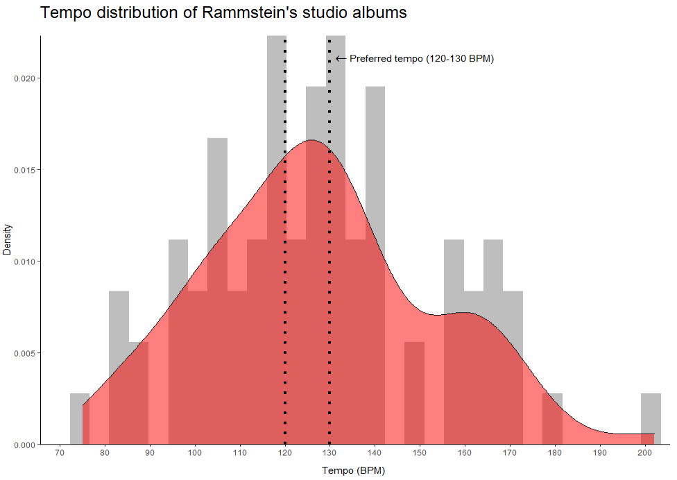

```{r setup, include=FALSE}
library(tidyverse)
library(spotifyr)
library(fmsb)
library(ggradar)
library(ggplot2)
library(tidyverse)
library(statebins)
library(Rmisc)
library(ggiraph)
library(ggplotlyExtra)
library(RColorBrewer)
library(plotly)
library(scales)
library(lubridate)
library(compmus)
library(factoextra)
library(viridisLite)
library(ggiraphExtra)
library(gridExtra)
library(flexdashboard)
library(DiagrammeR)
library(data.table)
library(dplyr)
library(formattable)
library(tidyr)
library(shiny)
library(shinyWidgets)
```

Visualization {.storyboard}
=========================================

### NEW Which album is this song from? Algorithm is *very* confused by Rammstein
```{r}
knitr::include_graphics("all features prediction.png")
```

***
k-Nearest Neighbour (k-NN) classification algorithm has been applied to the dataset in order to classify the songs into albums using computational methods. Unfortunately, k-NN performs poorly on the present dataset. The best obtained score is 5/11 songs correctly classified, that is for Herzeleid. Precision and recall scores, summarized below, indicate an abundance of both false negatives and false positives. For instance, for RAMMSTEIN album, both precision and recall are 0. Low recall means that songs from a particular album are not categorized into the same album by the algorithm. Low precision means that the algorithm also thinks that a lot of songs from other albums belong to an album in question. The only acceptable scores are for Herzeleid, although recall is still quite poor.

| Album                 | Precision | Recall    |
|-----------------------|-----------|-----------|
| Herzeleid             | 0.7142857 | 0.4545455 |
| LIEBE IST FÜR ALLE DA | 0.2500000 | 0.1875000 |
| Mutter                | 0.1428571 | 0.1818182 | 
| RAMMSTEIN             | 0.0000000 | 0.0000000 |
| Reise, Reise          | 0.2000000 | 0.1818182 |
| ROSENROT              | 0.2307692 | 0.2727273 |
| Sehnsucht             | 0.2500000 | 0.2727273 |

Choosing top predictors (loudness, c12, c04) and features used for previous analyses (danceability, energy, valence, loudness and tempo) did not majorly improve things (should I add another table with precisions and recalls for these? The values for both are also awful)

### NEW K-means and Clustering: Sehnsucht & Mutter are Neighbours, Rosenrot is their Distant Friend
```{r}
knitr::include_graphics("Distance matrix for albums1.png")
knitr::include_graphics("Hierarchical clustering.png")
```

***
K-NN is a supervised learning algorithm that is useful for classification and regression problems. As was seen from the knn analysis, the performance is poor. So, I have decided to use an unsupervised learning algorithm made to tackle clustering problems, that is k-means. Here, I have tried to group the albums into bigger clusters, which would show which albums are similar and which are different. The distance matrix based on danceability, energy, valence, loudness and tempo shows the distance between album pairs. The closer to 0 (black colour), the less distance, thus the more similar are albums. There is a black diagonal line that indicates that albums are identical, that is distance = 0, because we are comparing an album to itself. \

Hierarchical clustering algorithm was used to group similar objects together. Objects within each cluster are similar to each other. The amount of clusters (3) was chosen after applying the "Elbow" method. 
In this method, sum of squares at each number of clusters (in my case, from 2 to 5) are calculated and plotted. Afterwards, by determining the "elbow" (a point at which the slope changes from steep to shallow), the user can determine an optimal number of clusters. This method is not as precise as other, more mathematically-rigorous cluster-validation methods, but seemed to work for the current (small) dataset. \
Indeed, as can be seen from both the matrix and hierarchical clustering, Sehnsucht and Mutter share more similarities with each other than with Rosenrot, which is grouped with Rammstein. (should I include k-means clustering?) \

### Valence and Energy in Context: **Rammstein** is *Angry*, but also *Happy* and not *Calm* at All
```{r}

```

***
(tba)


### Tempo histogram
```{r}

```

***
Moelants (2002, link tba) showed that there is a certain preferred tempo at around 125 BPM. This natural tempo corresponds with both repeated motor actions and perceived tempo in musical data. As can be seen from the plot, Rammsteins songs mostly fall in 115-140 BPM frame. Interestingly, WEIT WEG does not sound that fast perceptually. This disproportional BPM score might indicate a flaw in the tempo estimation algorithm used by Spotify.

### Tempogram Ich will feuer frei

```{r}
knitr::include_graphics("tempograms.png")
```

***
tba


### Plotting popularity
```{r}
pop_overall <- read_csv(file = "pop_sel_alb_tot.csv")

pop_overall$album.year <- factor(pop_overall$album.year, levels = c("Herzeleid (1995)", "Sehnsucht (1997)", "Mutter (2001)", "REISE, REISE (2004)", "ROSENROT (2005)", "LIEBE IST FÜR ALLE DA (2009)", "RAMMSTEIN (2019)"))

pop_alb <- read_csv(file = "pop_only_albums.csv")

pop_boxplot <- ggplot(pop_overall, aes(x = album.year, 
                                       y = track.popularity,
                                       label = track.name,
                                       colour = album.year)) +
  geom_boxplot(show.legend = FALSE,
               alpha = 0.4,
               outlier.shape = NA) +
  geom_jitter(data = pop_overall, 
              width = 0.25, 
              alpha = 0.7,
              show.legend = FALSE) +
  geom_hline(yintercept = 81, linetype = "dashed", color = "red") +
  geom_text(aes("REISE, REISE (2004)", 83, label = "Rammstein Popularity", vjust = -1), colour = "black") +
  labs(title = "Spotify popularity metric: song, album, artist. (+ indicates album's popularity)",
       x = "Albums",
       y = "Popularity") +
  theme(legend.position = "none",
        axis.text.x = element_text(angle = 45),
        axis.line = element_line(colour = "black"),
        panel.grid.minor.x = element_blank(),
        panel.grid.major.x = element_blank(),
        panel.background = element_rect(fill = 'white'),
        panel.grid.major.y = element_line(color = "grey")) +
  scale_color_manual(name = "album.year", values = c("orange", 
                                                     "darkblue", 
                                                     "darkolivegreen2", 
                                                     "orangered2", 
                                                     "royalblue2", 
                                                     "wheat4", 
                                                     "tan")) +
  geom_point(aes(x = "Herzeleid (1995)", y = 67), colour = "black", shape = 3) +
  geom_text(aes("Herzeleid (1995)", 69, label = "67", vjust = -1), size = 3, colour = "black") + 
  geom_point(aes(x = "Sehnsucht (1997)", y = 74), colour = "black", shape = 3) +
  geom_text(aes("Sehnsucht (1997)", 76, label = "74", vjust = -1), size = 3, colour = "black") + 
  geom_point(aes(x = "Mutter (2001)", y = 75), colour = "black", shape = 3) +
  geom_text(aes("Mutter (2001)", 77, label = "75", vjust = -1), size = 3, colour = "black") + 
  geom_point(aes(x = "REISE, REISE (2004)", y = 73), colour = "black", shape = 3) +
  geom_text(aes("REISE, REISE (2004)", 75, label = "73", vjust = -1), size = 3, colour = "black") + 
  geom_point(aes(x = "ROSENROT (2005)", y = 68), colour = "black", shape = 3) +
  geom_text(aes("ROSENROT (2005)", 70, label = "68", vjust = -1), size = 3, colour = "black") + 
  geom_point(aes(x = "LIEBE IST FÜR ALLE DA (2009)", y = 70), colour = "black", shape = 3) +
  geom_text(aes("LIEBE IST FÜR ALLE DA (2009)", 72, label = "70", vjust = -1), size = 3, colour = "black") + 
  geom_point(aes(x = "RAMMSTEIN (2019)", y = 77), colour = "black", shape = 3) + 
  geom_text(aes("RAMMSTEIN (2019)", 79, label = "77", vjust = -1), size = 3, colour = "black")
ggplotly(pop_boxplot, tooltip = c("track.popularity", "track.name"))
```

***
(tbu)


### "Constants" in the Corpus 

```{r}
constants <- read_csv("constant_features.csv")

constants$Album <- factor(constants$Album, levels = c("Herzeleid (1995)", "Sehnsucht (1997)", "Mutter (2001)", "Reise, Reise (2004)", "Rosenrot (2005)", "Liebe ist für alle da (2009)", "Rammstein (2019)"))

constants_plot <- ggplot(data = constants, aes(x = Album, y = Value, group = Feature)) +
  geom_line(aes(colour = Feature)) +
  geom_point(aes(color = Feature), alpha = 0.5, shape = 23, size = 2) + 
  theme(axis.text.x = element_text(angle = 45),
        axis.line = element_line(colour = "black"),
        panel.grid.minor.x = element_blank(),
        panel.grid.major.x = element_blank(),
        panel.background = element_rect(fill = 'white'),
        panel.grid.major.y = element_line(color = "grey")) +
  scale_color_manual(name = "Feature", values = c("orangered2", 
                                                  "salmon4", 
                                                  "darkgrey", 
                                                  "darkblue")) +
  ggtitle("Mean Audio Feature Value per Album")
ggplotly(constants_plot)
```

*** 
(tbu)

Introduction {.storyboard}
=======================================================================

### (A)Typical Rammstein: Perception vs Computation
```{r}
heatmap_data <- read_csv(file = "heatmap_test.csv")
heatmap_data[, 3] <- round(heatmap_data[, 3], digits = 3)

heatmap_table <- ggplot(heatmap_data, aes(x = Feature, 
                                          y = Song, 
                                          fill = Value)) +
  geom_tile() + 
  theme_minimal() + 
  scale_x_discrete(position = "top") + 
  scale_y_discrete(limits = c("Roter Sand - Orchester Version", "Ein Lied", "Ausländer", "Te Quiero Puta!", "Hallomann", "Feuer Frei!", "Ich will", "Du Hast")) +
  scale_fill_gradient(low = "#f0c7c7",
                      high = "#db0707",
                      space = "Lab",
                      na.value = "grey50",
                      guide = "colourbar",
                      aesthetics = "fill") + 
  theme(axis.ticks.x = element_blank(),
        axis.ticks.y  =  element_blank(),
        axis.text = element_text(size = 7),
        legend.text = element_text(size = 7),
        legend.title = element_text(size = 9),
        panel.grid = element_blank()) +
  ggtitle("Spotify Audio Features for typical and atypical Rammstein songs")

ggplotly(heatmap_table)
```

***
(tbu: playlist, add features that are not 0-1 to a separate table, re-arrange features)

For detailed, low-level audio analysis, typical and atypical songs have to be established. What songs would make you exclaim “yes, of course this is Rammstein”? Personally, I chose Du Hast and Ich will. Of course, this approach is highly subjective and influenced by a plethora of external reasons, such as track popularity, familiarity with the artist, individual biases and tastes. To expand the notion of “typical” to include not only my personal judgements, but also those of a potentially impartial algorithm, standardizes z-scores based on all audio features were computed. The songs that scored nearest to 0, mainly Feuer Frei! and Hallomann were chosen as representatives. 

The same approach was taken when selecting atypical songs. In my opinion, Te Quiero Puta! may be the most un-Rammstein song they have ever released. In the context of all their other recordings, this metal-meets-mariachi song sounds novel. Another unique track is Ausländer. It sounds so catchy and pop-y, that it might have been a successful (rock)club song. Unsurprisingly, z-scores indicated that Ein Lied and Roter Sand – Orchester Version differ from the rest of the corpus. 

Summary: typical songs - Feuer Frei!, Hallomann, Ich will, Du Hast; atypical songs – Ein Lied, Roter Sand – Orchester Version, Te Quiero Puta!, Ausländer.
 

### Extra things
```{r}
table_typatyp <- read_csv(file = "other_features.csv")

table_ta <- formattable(table_typatyp, 
            align =c("l","c","c", "c", "r"),
            list('Loudness' = color_tile("#f0c7c7", "#db0707"), 
                 'Tempo' = color_tile("#f0c7c7", "#db0707")))
table_ta
```

### Chordograms

```{r}
knitr::include_graphics("chordograms.png")
```

***
1st picture: chordogram for Te Quiero Puta!, 2nd picture: Ausländer (TBU: add titles directly to plots).
Althought both of these songs are labeled as atypical by me, they are very different when compared by chordograms. For Te Quiero Puta!, D:maj is noted by a darker band throughout the song. Around 160, a yellow line, indicating a bridge has started.
Ausländer chordogram, on the other hand, shows no clear patterns, except for darker bands at F:7 and D:maj.


### Self-similarity matrix

```{r}

knitr::include_graphics("self similarity roter sand halloman.png")
```

***
1st picture: SSM for Ausländer, 2nd picture: SSM for Du hast (TBU: add titles directly to plots).
The self-similarity matrix for Ausländer shows very clear repetitiveness in both chroma and timbre plots. The checkerboard pattern shows that a passage is repeated throughout the song. In Du hast timbre plot, we can see a couple of thin (60, 170) yellow lines, which highlight novel parts, whereas in Ausländer, the yellow lines are thicker and re-occur throughout the song.


### Rammstein: Exploring Album Acclaim through Spotify Audio Features

**Rammstein** is a German Neue Deutsche Härte band known for heavy riffs, thought provoking, although controversial, lyrics and flame-fuelled live performances. \
\
Almost unanimously, critics and fans alike agree on the worst **Rammstein** album, which is said to be *Rosenrot* (2005). Listeners note that the album is “[…] a disjointed effort glued together with some iron-clad bangers” ([Chillingworth, 2019](https://www.loudersound.com/features/every-rammstein-album-ranked-from-worst-to-best)) and “[…] feels like a thrown-together collection of B-sides (because, essentially, it was)” ([sean_themighty, 2019](https://www.reddit.com/r/Rammstein/comments/ap83rs/anybody_agree/)). \
\
Interestingly, album rankings oftentimes also agree on the best album – *Mutter* (2001), describing it as “[…] just....legendary” ([JonWood007
, 2020](https://www.reddit.com/r/Rammstein/comments/gbbs9i/all_rammstein_albums_ranked_from_worst_to_best/)). Furthermore, the album is ranked 324 in *Rock Hard* magazine's book of *The 500 Greatest Rock & Metal Albums of All Time* ([Rock Hard, 2005](https://en.wikipedia.org/wiki/Mutter_(album)#cite_note-11)). Another strong contender for the title of the most loved **Rammstein** album, sometimes tied with *Mutter*, is *Sehnsucht* (1997). The album contains well-known masterpieces, such as *Du hast* and *Engel*. \
\
Additionally, **Rammstein** has quite a recognizable sound that is usually attributed to distinctive guitars along with Till Lindemann’s baritone and exaggerated trills (so-called rolled r’s). \
\
Thus, in this portfolio, I will investigate whether Spotyfy's Audio Features and Popularity Score can provide insights on the following questions: \
1. Why *Mutter*/*Sehnsucht* are so well-received, whereas *Rosenrot* is subject to criticism? \
2. **Rammstein** signature sound: what audio features are constant throughout the discography? \
3. Typical and atypical **Rammstein**: exploring songs with audio features (computation vs perception). \
\
**Corpus** \
The corpus consists of released studio albums by **Rammstein** (7 albums, 82 songs), all of which are available on Spotify. In my opinion, the corpus is representative of the whole discography, as the majority of songs are included in the studio albums. The exceptions are *Das Modell* (non-album single, 1997), *Du riechst so gut '98* (which is a version of *Du riechst so gut* (*Herzeleid*, 1995) with a shorter intro) and *Mein Land* (exclusive to compilation album *Made in Germany 1995–2011* (2011)). Live albums are not taken into account, as the (fan-)reviewers usually do not rate live albums. Furthermore, there are no songs exclusive to live albums. \
\


### Audio Feature Overview per Album: Distinctive Danceability, Energy, Valence, Loudness and Tempo 

```{r figurename, echo = FALSE, out.width = '100%'}
knitr::include_graphics("geom_density album summary.png")

knitr::include_graphics("mode.png")
```

***

(TBU: tabs, improve conclusion, add more "high valence = positive explanations", other features - for Q3)

On the left, density plots of Spotify audio features for Rammstein’s studio albums are presented. 
Danceability seems to vary per album. It is clear that Sehnsucht (and Herzeleid) have the highest overall danceability. Conversely, the majority of songs from Rosenrot are located lower on the danceability scale. Furthermore, danceability is one of the most mysterious Spotify’s audio features, as the listener’s perception of danceability for a song sometimes conflicts with the value awarded by Spotify. For instance, Du Riechst So Gut has a danceability score of 0.67, whereas I'm Looking Forward to Joining You, Finally (Nine Inch Nails) was awarded with a striking score of 0.795.
Energy distribution per album shows that overall, Rammstein’s discography boasts high energy. Sehnsucht’s energy is concentrated at around 0.95, while Rosenrot’s energy peak is seen at 0.7.
Next, valence plot illustrates Rosenrot as a clear outlier. 
Another interesting visualization is loudness. Both Rosenrot and Sehnsucht exhibit a strong peak at -5. Although Mutter’s highest density shares the same value, the peak is weak.
Finally, regarding tempo, Rosenrot has more songs in 160 (BPM) tempo range than other albums. 

Second tab highlights the key distribution per album. Spotify uses standard Pitch class notation, so the key values range from 0 (C) to 11 (B). Every Rammstein album has notable variation in keys, averaging at 7 keys per album. Mutter seems to be an outlier, with only 4 keys implemented, mainly 2 (D), 3 (D♯/E♭), 4 (E) and 9 (A). Overall, no clear key preference can be seen throughout the discography.

The third tab shows a stacked mode bar chart, where 0 represents Minor mode and 1 corresponds to Major mode. As can be seen, major mode is preferred throughout all albums. This might be a shocker for some, as Rammstein’s music does not sound necessarily positive, which only further demonstrates that major ≠ happy and minor ≠ sad.

Conclusion: Mutter, Sehnsucht, Rosenrot are going to be analyzed in-depth based on danceability, energy, valence, loudness and tempo. 


### Atypical song: Ausländer chroma features

```{r}
knitr::include_graphics("chroma features.png")
```


***
The melody seems to be the strongest in A#/Bb.