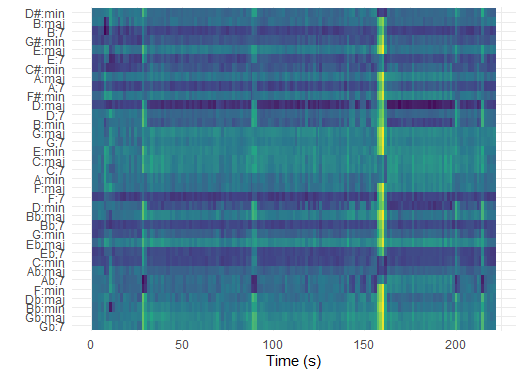

### NEW Chordograms

```{r}


```

***
1st picture: chordogram for Te Quiero Puta!, 2nd picture: Ausländer (TBU: add titles directly to plots).
Althought both of these songs are labeled as atypical by me, they are very different when compared by chordograms. For Te Quiero Puta!, D:maj is noted by a darker band throughout the song. Around 160, a yellow line, indicating a bridge has started.
Ausländer chordogram, on the other hand, shows no clear patterns, except for darker bands at F:7 and D:maj.


### NEW Self-similarity matrix

```{r}


```

***
1st picture: SSM for Ausländer, 2nd picture: SSM for Du hast (TBU: add titles directly to plots).
The self-similarity matrix for Ausländer shows very clear repetitiveness in both chroma and timbre plots. The checkerboard pattern shows that a passage is repeated throughout the song. In Du hast timbre plot, we can see a couple of thin (60, 170) yellow lines, which highlight novel parts, whereas in Ausländer, the yellow lines are thicker and re-occur throughout the song.


### Rammstein: Exploring Album Acclaim through Spotify Audio Features
**Rammstein** is a German Neue Deutsche Härte band known for heavy riffs, thought provoking, although controversial, lyrics and flame-fuelled live performances. \
\
Almost unanimously, critics and fans alike agree on the worst **Rammstein** album, which is said to be *Rosenrot* (2005). Listeners note that the album is “[…] a disjointed effort glued together with some iron-clad bangers” ([Chillingworth, 2019](https://www.loudersound.com/features/every-rammstein-album-ranked-from-worst-to-best)) and “[…] feels like a thrown-together collection of B-sides (because, essentially, it was)” ([sean_themighty, 2019](https://www.reddit.com/r/Rammstein/comments/ap83rs/anybody_agree/)). \
\
Interestingly, album rankings oftentimes also agree on the best album – *Mutter* (2001), describing it as “[…] just....legendary” ([JonWood007
, 2020](https://www.reddit.com/r/Rammstein/comments/gbbs9i/all_rammstein_albums_ranked_from_worst_to_best/)). Furthermore, the album is ranked 324 in *Rock Hard* magazine's book of *The 500 Greatest Rock & Metal Albums of All Time* ([Rock Hard, 2005](https://en.wikipedia.org/wiki/Mutter_(album)#cite_note-11)). Another strong contender for the title of the most loved **Rammstein** album, sometimes tied with *Mutter*, is *Sehnsucht* (1997). The album contains well-known masterpieces, such as *Du hast* and *Engel*. \
\
Additionally, **Rammstein** has quite a recognizable sound that is usually attributed to distinctive guitars along with Till Lindemann’s baritone and exaggerated trills (so-called rolled r’s). \
\
Thus, in this portfolio, I will investigate whether Spotyfy's Audio Features and Popularity Score can provide insights on the following questions: \
1. Why *Mutter*/*Sehnsucht* are so well-received, whereas *Rosenrot* is subject to criticism? \
2. **Rammstein** signature sound: what audio features are constant throughout the discography? \
3. Typical and atypical **Rammstein**: exploring songs with (computation vs perception). \
\
**Corpus** \
The corpus consists of released studio albums by **Rammstein** (7 albums, 82 songs), all of which are available on Spotify. In my opinion, the corpus is representative of the whole discography, as the majority of songs are included in the studio albums. The exceptions are *Das Modell* (non-album single, 1997), *Du riechst so gut '98* (which is a version of *Du riechst so gut* (*Herzeleid*, 1995) with a shorter intro) and *Mein Land* (exclusive to compilation album *Made in Germany 1995–2011* (2011)). Live albums are not taken into account, as the (fan-)reviewers usually do not rate live albums. Furthermore, there are no songs exclusive to live albums. \
\


### Feature overview by album

```{r figurename, echo = FALSE, fig.cap = "Spotify Audio Feature Densities of Rammstein Albums", out.width = '100%'}
knitr::include_graphics("Rplot.png")
```

***

Interesting plots: key, danceability, loudness, energy.
Suggested patterns: Mutter differs in key, otherwise Mutter, Rosenrot and Sehnsucht do not seem to differ.
TBU: change mode and key graphs to histograms, make plots with only 3 aforementioned albums, add in-depth interpretation, change size of the plots, plotly

### Atypical song: Ausländer chroma features

```{r}

```


***
The melody seems to be the strongest in A#/Bb.