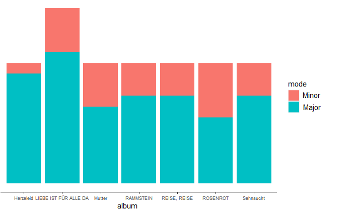
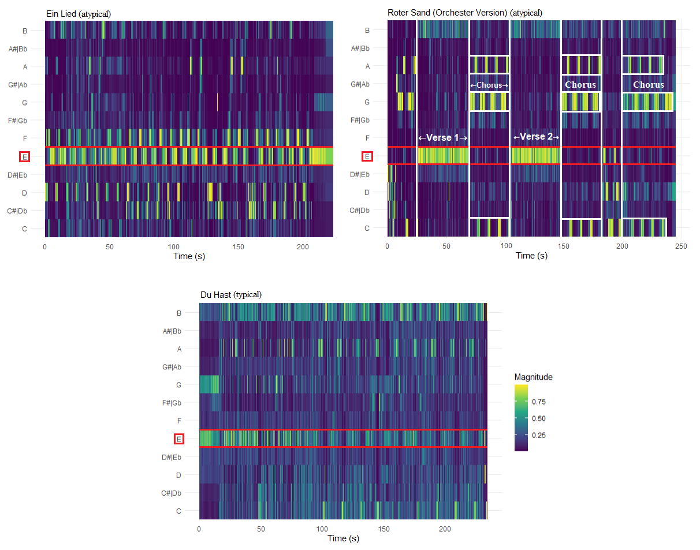

```{r setup, include=FALSE}
library(tidyverse)
library(rvest)
library(spotifyr)
library(fmsb)
library(ggradar)
library(ggplot2)
library(tidyverse)
library(statebins)
library(Rmisc)
library(ggiraph)
library(ggplotlyExtra)
library(RColorBrewer)
library(plotly)
library(scales)
library(lubridate)
library(compmus)
library(factoextra)
library(viridisLite)
library(ggiraphExtra)
library(gridExtra)
library(flexdashboard)
library(DiagrammeR)
library(data.table)
library(dplyr)
library(formattable)
library(tidyr)
library(shiny)
library(shinyWidgets)
```

Visualization {.storyboard}
=========================================

### Which album is this song from? Algorithm is *baffled* by Rammstein {data-commentary-width=550}
```{r}
knitr::include_graphics("all features prediction.png")
```

***
**k-Nearest Neighbour (k-NN) classification algorithm** has been applied to the dataset in order to classify the songs into albums using computational methods. If the predictions are accurate, we can infer that albums significantly differ from each other, which would further aid my *Mutter/Sehnsucht* vs *Rosenrot* debate. \
\
Unfortunately, k-NN performs poorly on Rammstein's discography. The **best obtained score is 5/11 songs correctly classified**, that is for *Herzeleid*. Precision and recall scores, summarized below, indicate an abundance of both false negatives and false positives. For instance, for *RAMMSTEIN* album, both precision and recall are 0. \
\
**Low recall** means that songs from a particular album are not categorized into the same album by the algorithm. **Low precision** means that the algorithm also thinks that a lot of songs from other albums belong to an album in question. The only acceptable scores are for *Herzeleid*, although recall is still quite poor. \
\
**Album (Precision, Recall)**: \
- Herzeleid (0.7142857, 0.4545455) \
- LIEBE IST FÜR ALLE DA (0.2500000, 0.1875000) \
- Mutter (0.1428571, 0.1818182) \
- RAMMSTEIN (0.0000000, 0.0000000) \
- Reise, Reise (0.2000000, 0.1818182) \
- ROSENROT (0.2307692, 0.2727273) \
- Sehnsucht (0.2500000; 0.2727273) \
\
Choosing top predictors (loudness, c12, c04) and features used for previous analyses (danceability, energy, valence, loudness and tempo) did not majorly improve things. \
\
**Training a classifier using so many categories (Audio Features, timbre components), whilst having a small corpus (82 songs) will most probably lead to poor performance, as the variability is extremely high. No definite conclusions can be drawn from k-NN results. **


### NEW K-means and Clustering: Sehnsucht & Mutter are Neighbours, Rosenrot is their Distant Friend
```{r}

knitr::include_graphics("Hierarchical clustering.png")
```

***
K-NN is a supervised learning algorithm that is useful for classification and regression problems. As was seen from the knn analysis, the performance is poor. So, I have decided to use an unsupervised learning algorithm made to tackle clustering problems, that is k-means. Here, I have tried to group the albums into bigger clusters, which would show which albums are similar and which are different. The distance matrix based on danceability, energy, valence, loudness and tempo shows the distance between album pairs. The closer to 0 (black colour), the less distance, thus the more similar are albums. There is a black diagonal line that indicates that albums are identical, that is distance = 0, because we are comparing an album to itself. \

Hierarchical clustering algorithm was used to group similar objects together. Objects within each cluster are similar to each other. The amount of clusters (3) was chosen after applying the "Elbow" method. 
In this method, sum of squares at each number of clusters (in my case, from 2 to 5) are calculated and plotted. Afterwards, by determining the "elbow" (a point at which the slope changes from steep to shallow), the user can determine an optimal number of clusters. This method is not as precise as other, more mathematically-rigorous cluster-validation methods, but seemed to work for the current (small) dataset. \
Indeed, as can be seen from both the matrix and hierarchical clustering, Sehnsucht and Mutter share more similarities with each other than with Rosenrot, which is grouped with Rammstein. (should I include k-means clustering?) \

### **Valence** and **Energy** in context: **Rammstein** is *angry*, but also *happy* and not *calm* at all {data-commentary-width=500}
```{r}
knitr::include_graphics("emotions.png")
```

***
Spotify's Audio Features sometimes might seem a bit isolated from the real world. **Valence** is said to be ["a measure describing the musical positiveness conveyed by a track"](https://developer.spotify.com/documentation/web-api/reference/#object-audiofeaturesobject). The higher the valence score, the more positive, happy and cheerful the song sounds. **Energy** is labelled as ["perceptual measure of intensity and activity"](https://developer.spotify.com/documentation/web-api/reference/#object-audiofeaturesobject). Tracks with high energy are typically fast, loud and noisy. \
\
But how **perceptually sound** these measures *really* are?\
\
To tackle this question, I decided to look at the corpus in the context of **[valence-arousal model of emotion (circumplex model)](https://content.apa.org/record/1981-25062-001)**. In this model, emotions are distributed in a 2D circular space. The dimensions are arousal (Spotify's energy) and valence. The combinations of these features result in 4 emotion quadrants - **calm**, **happy**, **sad** or **angry**. Placing Rammstein's songs in this model can provide us with an overview of the emotions that their music evokes. \
\
The results of the classification are quite fascinating. Firstly, Rammstein has **no calm** songs, as the quadrant is absolutely empty. This is not unexpected, as Rammstein has only few ballads and those are in the *calm* category. The songs that are the closest to being *calm* are *[Los](https://open.spotify.com/track/679Tyyun9r41BvpDOTAAOo?autoplay=true)* and *[Laichzeit](https://open.spotify.com/track/7BQWcPnFAlkPVxJQAf20aq?autoplay=true)*. Perceptually, these two tracks might sound more monotone compared to others in *happy*, which places them lower on the energy scale, but they are still loud and fast. It is also a bizarre and grim experience seeing a song about incest and bestiality (Laichzeit) in the *happy* category...\
\
Secondly, the **happiest songs are [Bestrafe mich](https://open.spotify.com/track/5QueZSIpWUbH4nLZlkjjkP?si=108dc6646b134604) and [Eifersucht](https://open.spotify.com/track/2R5Zsb2TtsjHAEJFUZvf7v?si=00d5442604b84d03)**. Please take a listen and judge yourself whether these songs sound happy! I would guess that they do not. To me, [Ausländer](https://open.spotify.com/track/7j43FohbLVulScL7S9sQZk?si=3fbfb78e83f04eb8) is the happiest track out of the whole discography, but it is in the *angry* quadrant. These misalignments might indicate that Spotify's **features do not directly correspond to arousal and valence of the circumplex model**. \
\
The **angriest song is [Rammlied](https://open.spotify.com/track/2BQFnSQymvASqEMIrwe7tp?si=16cb452cbf3c4fa9)**, which I agree with. This powerful album opening song has an apocalyptic vibe to it, with pronounced guitar riffs and devilish Till's vocals juxtaposed with church choir in the background. This is a grandstanding song that just sounds *powerful and furious*. \
\
Unsurprisingly, **[Ein Lied](https://open.spotify.com/track/4L4oCtdmqjxS8AjkzjLGDQ) is the most unhappy song**. Ein Lied is one of their slowest songs, with acoustic guitars, ethereal synthesizers and theremin-like keyboards being the focus of the song's instrumental. The percussion is completely absent from this song. The vocal line is soft, partly spoken, partly sung using low breathy tones, which is atypical of Rammstein. \
\
Overall, **the majority of songs are in the *angry* category and none in *calm***, which, in my opinion, aligns with the public's perception of Rammstein and metal music in general. No specific trends per album can be seen. 

### **Rammstein's** *preferred tempo*: does it align with Moelants'? {data-commentary-width=330}
```{r}
knitr::include_graphics("tempo density.png")
```

***
[Moelants (2002)](https://citeseerx.ist.psu.edu/viewdoc/download?doi=10.1.1.465.8019&rep=rep1&type=pdf) showed that there is a certain **preferred tempo at around 125 BPM**. This natural tempo corresponds with both repeated motor actions, such as finger tapping, and perceived tempo in musical data. As can be seen from the plot, **Rammstein's** songs mostly fall in **115-140 BPM** frame, with a **visible peak at 120-130 BPM**. \
\
Moelants' findings, current corpus' tempo distribution and [Spotify's own value distribution for tempo](https://developer.spotify.com/assets/audio/tempo.png) align pretty neatly, with **noticeable spikes at 120-130 BPM** marks.\
\
Although metal music can cover a wide scale of tempos, **preferred tempo range is still reflected in Rammstein's discography**, further indicating that it indeed might be more *natural* to compose songs in that tempo range.\


### Tempogram Ich will feuer frei

```{r}
knitr::include_graphics("tempograms.png")
```

***
tba


### Plotting popularity
```{r}
pop_overall <- read_csv(file = "pop_sel_alb_tot.csv")

pop_overall$album.year <- factor(pop_overall$album.year, levels = c("Herzeleid (1995)", "Sehnsucht (1997)", "Mutter (2001)", "REISE, REISE (2004)", "ROSENROT (2005)", "LIEBE IST FÜR ALLE DA (2009)", "RAMMSTEIN (2019)"))

pop_alb <- read_csv(file = "pop_only_albums.csv")

pop_boxplot <- ggplot(pop_overall, aes(x = album.year, 
                                       y = track.popularity,
                                       label = track.name,
                                       colour = album.year)) +
  geom_boxplot(show.legend = FALSE,
               alpha = 0.4,
               outlier.shape = NA) +
  geom_jitter(data = pop_overall, 
              width = 0.25, 
              alpha = 0.7,
              show.legend = FALSE) +
  geom_hline(yintercept = 81, linetype = "dashed", color = "red") +
  geom_text(aes("REISE, REISE (2004)", 83, label = "Rammstein Popularity", vjust = -1), colour = "black") +
  labs(title = "Spotify popularity metric: song, album, artist. (+ indicates album's popularity)",
       x = "Albums",
       y = "Popularity") +
  theme(legend.position = "none",
        axis.text.x = element_text(angle = 45),
        axis.line = element_line(colour = "black"),
        panel.grid.minor.x = element_blank(),
        panel.grid.major.x = element_blank(),
        panel.background = element_rect(fill = 'white'),
        panel.grid.major.y = element_line(color = "grey")) +
  scale_color_manual(name = "album.year", values = c("orange", 
                                                     "darkblue", 
                                                     "darkolivegreen2", 
                                                     "orangered2", 
                                                     "royalblue2", 
                                                     "wheat4", 
                                                     "tan")) +
  geom_point(aes(x = "Herzeleid (1995)", y = 67), colour = "black", shape = 3) +
  geom_text(aes("Herzeleid (1995)", 69, label = "67", vjust = -1), size = 3, colour = "black") + 
  geom_point(aes(x = "Sehnsucht (1997)", y = 74), colour = "black", shape = 3) +
  geom_text(aes("Sehnsucht (1997)", 76, label = "74", vjust = -1), size = 3, colour = "black") + 
  geom_point(aes(x = "Mutter (2001)", y = 75), colour = "black", shape = 3) +
  geom_text(aes("Mutter (2001)", 77, label = "75", vjust = -1), size = 3, colour = "black") + 
  geom_point(aes(x = "REISE, REISE (2004)", y = 73), colour = "black", shape = 3) +
  geom_text(aes("REISE, REISE (2004)", 75, label = "73", vjust = -1), size = 3, colour = "black") + 
  geom_point(aes(x = "ROSENROT (2005)", y = 68), colour = "black", shape = 3) +
  geom_text(aes("ROSENROT (2005)", 70, label = "68", vjust = -1), size = 3, colour = "black") + 
  geom_point(aes(x = "LIEBE IST FÜR ALLE DA (2009)", y = 70), colour = "black", shape = 3) +
  geom_text(aes("LIEBE IST FÜR ALLE DA (2009)", 72, label = "70", vjust = -1), size = 3, colour = "black") + 
  geom_point(aes(x = "RAMMSTEIN (2019)", y = 77), colour = "black", shape = 3) + 
  geom_text(aes("RAMMSTEIN (2019)", 79, label = "77", vjust = -1), size = 3, colour = "black")
ggplotly(pop_boxplot, tooltip = c("track.popularity", "track.name"))
```

***
(tbu)


### "Constants" in the Corpus 

```{r}
constants <- read_csv("constant_features.csv")

constants$Album <- factor(constants$Album, levels = c("Herzeleid (1995)", "Sehnsucht (1997)", "Mutter (2001)", "Reise, Reise (2004)", "Rosenrot (2005)", "Liebe ist für alle da (2009)", "Rammstein (2019)"))

constants_plot <- ggplot(data = constants, aes(x = Album, y = Value, group = Feature)) +
  geom_line(aes(colour = Feature)) +
  geom_point(aes(color = Feature), alpha = 0.5, shape = 23, size = 2) + 
  theme(axis.text.x = element_text(angle = 45),
        axis.line = element_line(colour = "black"),
        panel.grid.minor.x = element_blank(),
        panel.grid.major.x = element_blank(),
        panel.background = element_rect(fill = 'white'),
        panel.grid.major.y = element_line(color = "grey")) +
  scale_color_manual(name = "Feature", values = c("orangered2", 
                                                  "salmon4", 
                                                  "darkgrey", 
                                                  "darkblue")) +
  ggtitle("Mean Audio Feature Value per Album")
ggplotly(constants_plot)
```

*** 
(tbu)

Introduction {.storyboard}
=======================================================================

### (A)Typical Rammstein: Perception vs Computation
```{r}
heatmap_data <- read_csv(file = "heatmap_test.csv")
heatmap_data[, 3] <- round(heatmap_data[, 3], digits = 3)

heatmap_table <- ggplot(heatmap_data, aes(x = Feature, 
                                          y = Song, 
                                          fill = Value)) +
  geom_tile() + 
  theme_minimal() + 
  scale_x_discrete(position = "top") + 
  scale_y_discrete(limits = c("Roter Sand - Orchester Version", "Ein Lied", "Ausländer", "Te Quiero Puta!", "Hallomann", "Feuer Frei!", "Ich will", "Du Hast")) +
  scale_fill_gradient(low = "#f0c7c7",
                      high = "#db0707",
                      space = "Lab",
                      na.value = "grey50",
                      guide = "colourbar",
                      aesthetics = "fill") + 
  theme(axis.ticks.x = element_blank(),
        axis.ticks.y  =  element_blank(),
        axis.text = element_text(size = 7),
        legend.text = element_text(size = 7),
        legend.title = element_text(size = 9),
        panel.grid = element_blank()) +
  ggtitle("Spotify Audio Features for typical and atypical Rammstein songs")

ggplotly(heatmap_table)
```

***
(tbu: playlist, add features that are not 0-1 to a separate table, re-arrange features)

For detailed, low-level audio analysis, typical and atypical songs have to be established. What songs would make you exclaim “yes, of course this is Rammstein”? Personally, I chose Du Hast and Ich will. Of course, this approach is highly subjective and influenced by a plethora of external reasons, such as track popularity, familiarity with the artist, individual biases and tastes. To expand the notion of “typical” to include not only my personal judgements, but also those of a potentially impartial algorithm, standardizes z-scores based on all audio features were computed. The songs that scored nearest to 0, mainly Feuer Frei! and Hallomann were chosen as representatives. 

The same approach was taken when selecting atypical songs. In my opinion, Te Quiero Puta! may be the most un-Rammstein song they have ever released. In the context of all their other recordings, this metal-meets-mariachi song sounds novel. Another unique track is Ausländer. It sounds so catchy and pop-y, that it might have been a successful (rock)club song. Unsurprisingly, z-scores indicated that Ein Lied and Roter Sand – Orchester Version differ from the rest of the corpus. 

Summary: typical songs - Feuer Frei!, Hallomann, Ich will, Du Hast; atypical songs – Ein Lied, Roter Sand – Orchester Version, Te Quiero Puta!, Ausländer.
 

### Extra things
```{r}
table_typatyp <- read_csv(file = "other_features.csv")

table_ta <- formattable(table_typatyp, 
            align =c("l","c","c", "c", "r"),
            list('Loudness' = color_tile("#f0c7c7", "#db0707"), 
                 'Tempo' = color_tile("#f0c7c7", "#db0707")))
table_ta
```

### Chordograms

```{r}
knitr::include_graphics("chordograms.png")
```

***
1st picture: chordogram for Te Quiero Puta!, 2nd picture: Ausländer (TBU: add titles directly to plots).
Althought both of these songs are labeled as atypical by me, they are very different when compared by chordograms. For Te Quiero Puta!, D:maj is noted by a darker band throughout the song. Around 160, a yellow line, indicating a bridge has started.
Ausländer chordogram, on the other hand, shows no clear patterns, except for darker bands at F:7 and D:maj.


### Self-similarity matrix

```{r}
knitr::include_graphics("self similarity auslander du hast.png")
knitr::include_graphics("self similarity roter sand halloman.png")
```

***
1st picture: SSM for Ausländer, 2nd picture: SSM for Du hast (TBU: add titles directly to plots).
The self-similarity matrix for Ausländer shows very clear repetitiveness in both chroma and timbre plots. The checkerboard pattern shows that a passage is repeated throughout the song. In Du hast timbre plot, we can see a couple of thin (60, 170) yellow lines, which highlight novel parts, whereas in Ausländer, the yellow lines are thicker and re-occur throughout the song.


### `r emo::ji("fire")` `r emo::ji("rock-on")` Why **Rammstein**? Get to know RQs and corpus `r emo::ji("rock-on")` `r emo::ji("fire")` {data-commentary-width=800}

<div style="max-width:1920px; margin: 0 auto;">

**Rammstein** is a German [Neue Deutsche Härte](https://en.wikipedia.org/wiki/Neue_Deutsche_H%C3%A4rte) band known for heavy riffs, thought-provoking, although controversial, lyrics and flame-fuelled live performances. \
\
Almost unanimously, critics and fans alike agree on the worst **Rammstein** album, which is said to be [*Rosenrot* (2005)](https://open.spotify.com/album/3PrS5X3QNdDUlBIE4bz6J2). Listeners note that the album is “[…] a disjointed effort glued together with some iron-clad bangers” ([Chillingworth, 2019](https://www.loudersound.com/features/every-rammstein-album-ranked-from-worst-to-best)) and “[…] feels like a thrown-together collection of B-sides (because, essentially, it was)” ([sean_themighty, 2019](https://www.reddit.com/r/Rammstein/comments/ap83rs/anybody_agree/)). \
\
Interestingly, album rankings oftentimes also agree on the best album – [*Mutter* (2001)](https://open.spotify.com/album/2tHCY2fDMi0NqeGZcAxNSc), describing it as “[…] just....legendary” ([JonWood007
, 2020](https://www.reddit.com/r/Rammstein/comments/gbbs9i/all_rammstein_albums_ranked_from_worst_to_best/)). Furthermore, the album is ranked 324 in *Rock Hard* magazine's book of *The 500 Greatest Rock & Metal Albums of All Time* [Rock Hard, 2005](https://en.wikipedia.org/wiki/Mutter_(album)#cite_note-11). Another strong contender for the title of the most loved **Rammstein** album, sometimes tied with *Mutter*, is [*Sehnsucht* (1997)](https://open.spotify.com/album/2w6Vy8qZLU4niyQAHyu0Ag). The album contains well-known masterpieces, such as *Du hast* and *Engel*. \
\
Additionally, **Rammstein** has quite a recognizable sound that is usually attributed to distinctive guitars along with Till Lindemann’s baritone and exaggerated trills (so-called rolled r’s). \
\
Thus, in this portfolio, I will investigate whether Spotyfy's Audio Features and Popularity Scores can provide insights on the following questions: \
**1.** Why *Mutter*/*Sehnsucht* are so well-received, whereas *Rosenrot* is subject to criticism? \
**2.** **Rammstein** signature sound: what audio features are constant throughout the discography? \
**3.** Typical and atypical **Rammstein**: what audio analyses can say about **Rammstein's**  songs? \
\
**Corpus** \
The corpus consists of released studio albums by **Rammstein** (7 albums, 82 songs), all of which are available on Spotify: \
- [*Herzeleid* (1995)](https://open.spotify.com/album/2AXNbmgbX2i21Niol6eYul?si=777b4385f2804971) \
- [*Sehnsucht* (1997)](https://open.spotify.com/album/2w6Vy8qZLU4niyQAHyu0Ag) \
- [*Mutter* (2001)](https://open.spotify.com/album/2tHCY2fDMi0NqeGZcAxNSc) \
- [*Reise, Reise* (2004)](https://open.spotify.com/track/6bvTzuFABmFnAAmVZ3nlMh?si=6c0a34167652445a) \
- [*Rosenrot* (2005)](https://open.spotify.com/album/3PrS5X3QNdDUlBIE4bz6J2) \
- [*Liebe ist für alle da* (2009)](https://open.spotify.com/album/29J0MchD0OWNeiMNbPDwfa?si=4005f993c4f74d90) \
- [*Untitled* (or RAMMSTEIN) (2019)](https://open.spotify.com/album/1LoyJQVHPLHE3fCCS8Juek?si=FnvCowknROKrf1BzXMerBQ) \
\
Click through the tabs to find out more!

***


### Audio Feature overview per album 1: **keys** vary, **mode** is major {data-commentary-width=500}

```{r out.width = "700px"}
knitr::include_graphics("key histograms.png")

```

***

To potentially pinpoint the differences that might have contributed to *Mutter*/*Sehnsucht* love and *Rosenrot* hate, it is useful to take a close-up look at Spotify's Audio Features. Furthermore, Audio Features were plotted to see which elements change or stay constant throughout the discography. \
\
The first histogram highlights the **key distribution per album**. Every Rammstein album has notable variation in keys, averaging at 7 keys per album. *Mutter* seems to be an outlier, with only 4 keys implemented, mainly D, E♭, E and A. Overall, **no clear key preference** can be seen throughout the discography. \
\
Second plot is a stacked bar chart that **illustrates minor/major modes in the corpus**. As can be seen, **major mode is preferred throughout all albums**. This might be a shocker for some, as Rammstein’s music does not sound necessarily *positive*, which only further demonstrates that *major ≠ happy* and *minor ≠ sad*.

### Audio Feature Overview per album 2: distinctive **danceability**, **energy**, **valence**, **loudness** and **tempo** {data-commentary-width=500}

```{r out.width = "800px"}

```

***

On the left, **density plots of Spotify Audio Features for Rammstein’s studio albums** are presented. Density plots show smoothed distribution of values and the peaks correspond to locations where there is the highest concentration of said values.\
\
**Danceability** seems to vary per album. It is clear that ***Sehnsucht*** (and *Herzeleid*) have **the highest overall danceability**. Conversely, the majority of songs from ***Rosenrot*** are located **lower on the danceability scale**. \
Interestingly, danceability is one of the most mysterious Spotify’s Audio Features, as the listener’s perception of danceability for a song sometimes conflicts with the value awarded by Spotify. For instance, [Du Riechst So Gut](https://open.spotify.com/track/73se54LukI1xEPE8XKsrWf) has a danceability score of 0.67/1, whereas [I'm Looking Forward to Joining You, Finally (Nine Inch Nails)](https://open.spotify.com/track/7hZ59R6Kg7oV5WEmpPFC64?si=b52b2a9a37b24296) was awarded with a striking score of 0.795/1.\
\
**Energy** distribution per album shows that overall, Rammstein’s discography boasts high energy. ***Sehnsucht’s* energy is concentrated at around 0.95**, while ***Rosenrot’s* energy peak is seen at 0.7**. \
\
Next, **valence** plot marks ***Rosenrot* as a clear outlier**. Low valence corresponds to more sad, angry music.\
\
Another interesting visualization is **loudness**. Both ***Rosenrot* and *Sehnsucht* exhibit a strong peak at -5**. Although ***Mutter’s*** highest density shares the same value, the **peak is weak**. \
\
Finally, regarding **tempo**, ***Rosenrot* has more songs in 160 BPM** tempo range than other albums. \
\
**Speechiness**, **liveness**, **acousticness** and **instrumentalness** do not seem to provide any interesting patterns regarding the three albums in question and also overall. \
\
**Audio Feature Overview Conclusion:** *Mutter*, *Sehnsucht*, *Rosenrot* are going to be analyzed in-depth based on **danceability**, **energy**, **valence**, **loudness** and **tempo**, as these features differ per album.


### No clue how **Rammstein** sounds? Take a listen! {data-commentary-width=600}

For those who are unfamiliar with the band, I have compiled a short (10 song) playlist with my favourite songs. Listen to "RAMMSTEIN: Beyond Du Hast" playlist here →

***
ADD AT THE END
<iframe src="https://open.spotify.com/embed/playlist/65oczv23Ru6JUSSgLdCnwe" width="300" height="380" frameborder="0" allowtransparency="true" allow="encrypted-media"></iframe>


### Atypical song: Ausländer chroma features

```{r}

```

***
The melody seems to be the strongest in A#/Bb.